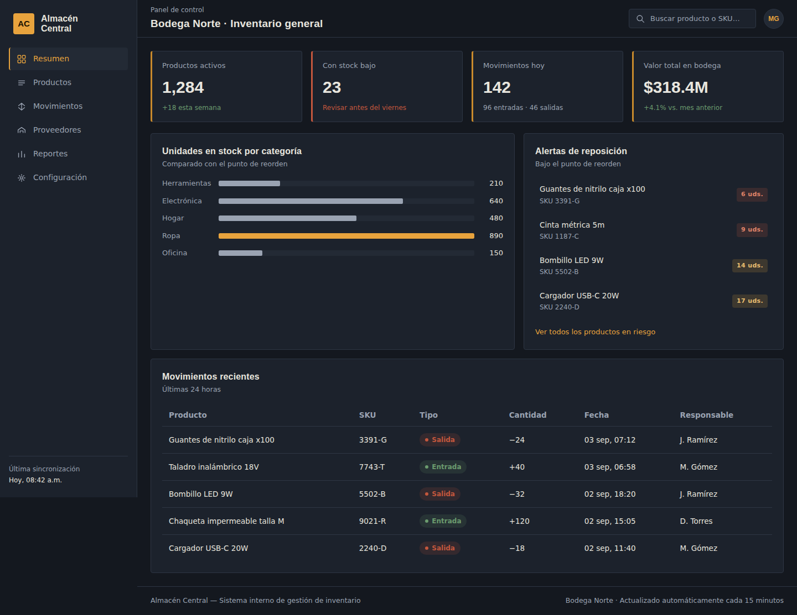
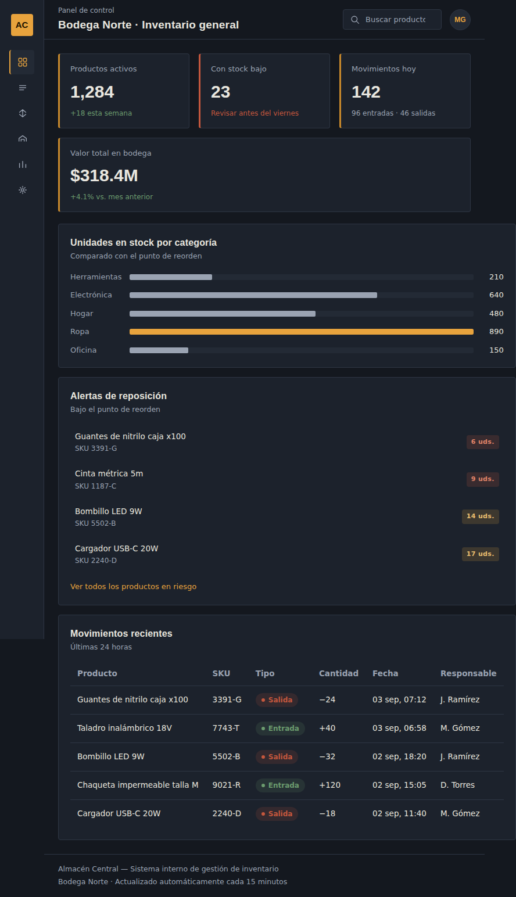
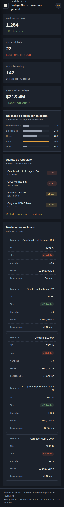
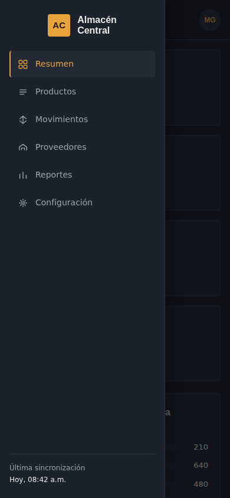

# Almacén Central — Panel de inventario

Dashboard administrativo para la gestión de inventario de una bodega. Muestra
el estado general del stock, alertas de productos por debajo del punto de
reorden, la distribución de unidades por categoría y el historial de
movimientos recientes (entradas y salidas).

Actividad 3 — Taller práctico: CSS3, Flexbox y Grid.



## Tecnologías usadas

- **HTML5 semántico**: `header`, `aside`, `main`, `footer`, roles ARIA
  (`role="navigation"`, `role="main"`, `role="banner"`, `role="contentinfo"`).
- **CSS3**:
  - **CSS Grid** para el layout principal (`grid-template-areas`: sidebar,
    header, main, footer).
  - **Flexbox** para los componentes internos: tarjetas de resumen, filas del
    gráfico de barras, lista de alertas, barra superior y celdas de la tabla
    en su versión móvil.
  - **Custom properties** (`:root`) para color, tipografía, radios y curvas
    de animación, de modo que el tema se controla desde un solo lugar.
  - **Media queries** en tres puntos de quiebre (escritorio, tablet ≤1024px,
    móvil ≤700px).
  - Transiciones y pseudo-clases (`:hover`, `:focus-visible`,
    `:focus-within`) para la interactividad visual.
- **JavaScript vanilla** (`script.js`): controla el menú lateral colapsable
  en móvil (abrir/cerrar, `aria-expanded`, cierre con `Escape`, cierre al
  hacer clic fuera del panel).
- **Google Fonts**: *Oswald* (títulos y etiquetas) + *Inter* (texto y datos).

No se usaron frameworks de CSS ni librerías de gráficos: el gráfico de
barras de "unidades por categoría" está construido con HTML y CSS puro
(`<ul role="img">` con una descripción `aria-label` completa como
alternativa textual).

## Estructura del proyecto

```
almacen-dashboard/
├── index.html
├── styles.css
├── script.js
├── README.md
└── evidencias/
    ├── escritorio.png
    ├── tablet.png
    ├── movil.png
    └── movil-menu-abierto.png
```

## Capturas de pantalla

### Escritorio (1440px)
Layout completo: sidebar fijo con navegación por íconos y texto, tarjetas de
resumen en fila, gráfico y alertas lado a lado, tabla de movimientos.


### Tablet (834px)
El sidebar se contrae a una columna de solo íconos (con `aria-label` para
lectores de pantalla) y la cuadrícula central pasa de dos columnas a una.



### Móvil (390px)
El sidebar se convierte en un panel deslizante (off-canvas) activado por el
botón de menú en el header. La tabla de movimientos se reorganiza como una
lista de tarjetas apiladas, cada celda con su etiqueta visible.

| Menú cerrado | Menú abierto |
|---|---|
|  |  |

## Decisiones de diseño

El punto de partida fue el contenido: una bodega necesita legibilidad rápida
de números (¿qué falta?, ¿qué se movió hoy?) más que ornamento. De ahí:

- **Paleta**: fondo casi negro (`#14181F`) con acento ámbar (`#E8A33D`),
  inspirado en la señalética de advertencia de bodegas industriales. El
  ámbar se reserva para lo que requiere atención (marca activa en el menú,
  la barra más alta del gráfico); el rojo óxido y el verde salvia codifican
  salidas/alertas y entradas/estado saludable respectivamente, siempre
  acompañados de texto (nunca solo color).
- **Tipografía**: *Oswald* (condensada) para títulos y para el nombre de la
  marca, evocando rótulos de estantería; *Inter* para los datos de la
  tabla y el cuerpo, priorizando legibilidad numérica
  (`font-variant-numeric: tabular-nums`).
- **Jerarquía por borde, no por sombra**: en vez de tarjetas idénticas con
  la misma sombra genérica, cada tarjeta de resumen usa un borde izquierdo
  de color que indica su urgencia (ámbar por defecto, rojo si requiere
  acción inmediata).
- **Un solo momento de movimiento**: la única animación no disparada por el
  usuario es la transición de ancho de las barras del gráfico al cargar;
  todo lo demás (hover en filas, apertura del menú) responde directamente a
  una acción del usuario, y se respeta `prefers-reduced-motion`.

## Accesibilidad

- Roles ARIA: `role="navigation"` en el sidebar, `role="main"` en el
  contenido principal, `role="banner"` y `role="contentinfo"` en header y
  footer, `aria-current="page"` en el enlace activo.
- Enlace "Saltar al contenido principal" (`skip-link`) visible al recibir
  foco, para navegación por teclado.
- El botón del menú móvil expone `aria-expanded` y `aria-controls`, y su
  `aria-label` cambia entre "Abrir" y "Cerrar menú de navegación".
- El menú móvil se puede cerrar con la tecla `Escape`, devolviendo el foco
  al botón que lo abrió.
- Estados de foco visibles (`:focus-visible`) en todos los elementos
  interactivos, con contraste suficiente sobre el fondo oscuro.
- El gráfico de barras incluye una descripción textual completa
  (`aria-label`) como alternativa a la información visual.
- Los íconos son SVG decorativos (`aria-hidden="true"`); el texto que los
  acompaña transmite el significado.
- Contraste verificado: el texto principal (`#E8E6DF` sobre `#14181F`) y los
  colores de estado superan la relación 4.5:1 exigida por WCAG AA.

## Cómo verlo

Abrir `index.html` directamente en el navegador, o servirlo con cualquier
servidor estático, por ejemplo:

```bash
npx serve .
```
